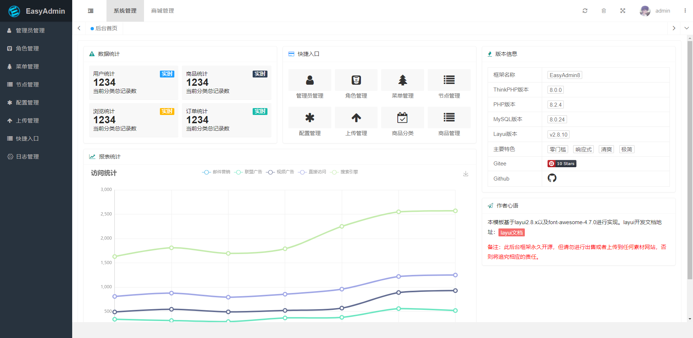

<div align="center" dir="auto">


<span></span>
<span></span>
<span></span>
<span></span>
<span></span>

</div>

## `EasyAdmin8`所有版本 (当前项目为`ThinkPHP`版本)

|          |                                Github                                |                               Gitee                               |
|----------|:--------------------------------------------------------------------:|:-----------------------------------------------------------------:|
| ThinkPHP |         [EasyAdmin8](https://github.com/wolf-leo/EasyAdmin8)         |         [EasyAdmin8](https://gitee.com/wolf18/EasyAdmin8)         |
| Laravel  | [EasyAdmin8-Laravel](https://github.com/wolf-leo/EasyAdmin8-Laravel) | [EasyAdmin8-Laravel](https://gitee.com/wolf18/EasyAdmin8-Laravel) |
| webman   |  [EasyAdmin8-webman](https://github.com/wolf-leo/EasyAdmin8-webman)  |  [EasyAdmin8-webman](https://gitee.com/wolf18/EasyAdmin8-webman)  |

## 项目介绍

> `EasyAdmin8` 在 [`EasyAdmin`](https://gitee.com/zhongshaofa/easyadmin) 的基础上更新 ThinkPHP 框架到 8.0 ，PHP 最低版本要求不低于 8.0
>
> ThinkPHP v8.0 和 Layui v2.9.x 的快速开发的后台管理系统。
>
> 项目地址：[http://easyadmin8.top](http://easyadmin8.top)
>
> 演示地址：[http://thinkphp.easyadmin8.top/admin](http://thinkphp.easyadmin8.top/admin)
>
> 如果您之前已经用过 `FastAdmin` 或者 `EasyAdmin` , 那么入手 `EasyAdmin8` 将会更加轻松
>
>【如果不能访问，可以自行本地搭建预览或参考下方界面预览图】

## 大版本更新记录：

[更新记录](log.md)

## 安装教程

> EasyAdmin8 使用 Composer 来管理项目依赖。因此，在使用 EasyAdmin8 之前，请确保你的机器已经安装了 Composer。

### 通过git下载安装包，composer安装依赖包

```
1.下载安装包

  git clone https://github.com/wolf-leo/EasyAdmin8

  或者

  git clone https://gitee.com/wolf18/EasyAdmin8

2.安装依赖包（确保 PHP 版本 >= 8.0）

  在根目录下 composer install ，如果有报错信息可以使用命令 composer install --ignore-platform-reqs
  
3. 拷贝 .example.env 文件重命名为 .env ，命令 cp .example.env .env ，修改数据库账号密码参数

4.配置伪静态(以 Nginx 为例)
  
  location / {
    if ( !-e $request_filename){
        rewrite ^/(.*)$ /index.php?s=$1 last;
        break;
    }
  }

```

## CURD命令大全

> 参考 [CURD命令大全](CURD.md)

## 常见问题

> 参考 [常见问题](https://easyadmin8.top/guide/question.html)

## 界面预览




## 交流群

<center>


</center>

## 相关文档

* [ThinkPHP 8.0](https://doc.thinkphp.cn/v8_0)

* [EasyAdmin](http://easyadmin.99php.cn/docs)

* [Layui 2.9.x](https://layui.dev/docs)

* [Layuimini](https://github.com/zhongshaofa/layuimini)

* [Annotations](https://github.com/doctrine/annotations)

* [Jquery](https://github.com/jquery/jquery)

* [RequireJs](https://github.com/requirejs/requirejs)

* [CKEditor](https://github.com/ckeditor/ckeditor4)

* [Echarts](https://github.com/apache/incubator-echarts)

* [UEditorPlus](https://github.com/modstart-lib/ueditor-plus)

* [wangEditor](https://github.com/wangeditor-team/wangEditor)

## 免责声明

> 所有协议遵循 [`EasyAdmin`](https://gitee.com/zhongshaofa/easyadmin)
>
> 任何用户在使用 `EasyAdmin8` 后台框架前，请您仔细阅读并透彻理解本声明。您可以选择不使用`EasyAdmin8`后台框架，若您一旦使用`EasyAdmin8`后台框架，您的使用行为即被视为对本声明全部内容的认可和接受。

* `EasyAdmin8`后台框架是一款开源免费的后台快速开发框架 ，主要用于更便捷地开发后台管理；其尊重并保护所有用户的个人隐私权，不窃取任何用户计算机中的信息。更不具备用户数据存储等网络传输功能。

* 您承诺秉着合法、合理的原则使用`EasyAdmin8`后台框架，不利用`EasyAdmin8`后台框架进行任何违法、侵害他人合法利益等恶意的行为，亦不将`EasyAdmin8`后台框架运用于任何违反我国法律法规的 Web 平台。

* 任何单位或个人因下载使用`EasyAdmin8`后台框架而产生的任何意外、疏忽、合约毁坏、诽谤、版权或知识产权侵犯及其造成的损失 (包括但不限于直接、间接、附带或衍生的损失等)，本开源项目不承担任何法律责任。

* 用户明确并同意本声明条款列举的全部内容，对使用`EasyAdmin8`后台框架可能存在的风险和相关后果将完全由用户自行承担，本开源项目不承担任何法律责任。

* 任何单位或个人在阅读本免责声明后，应在《MIT 开源许可证》所允许的范围内进行合法的发布、传播和使用`EasyAdmin8`后台框架等行为，若违反本免责声明条款或违反法律法规所造成的法律责任(包括但不限于民事赔偿和刑事责任），由违约者自行承担。

* 如果本声明的任何部分被认为无效或不可执行，其余部分仍具有完全效力。不可执行的部分声明，并不构成我们放弃执行该声明的权利。

* 本开源项目有权随时对本声明条款及附件内容进行单方面的变更，并以消息推送、网页公告等方式予以公布，公布后立即自动生效，无需另行单独通知；若您在本声明内容公告变更后继续使用的，表示您已充分阅读、理解并接受修改后的声明内容。